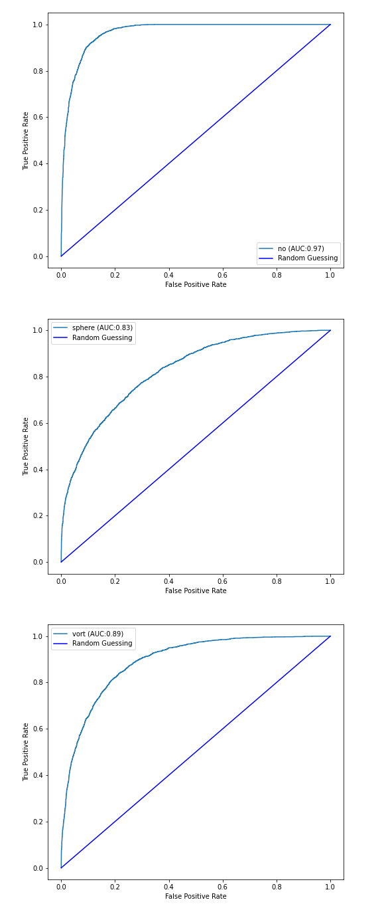
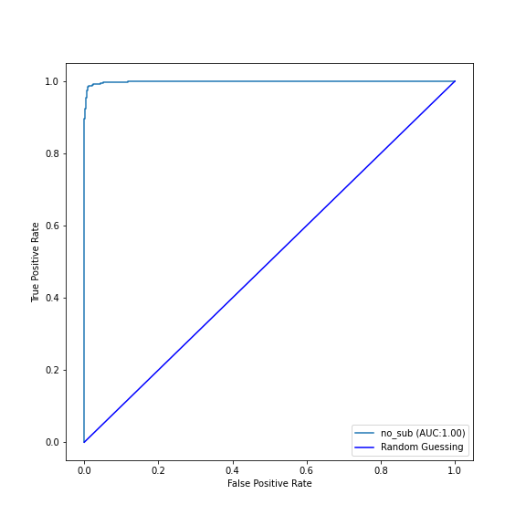

# Evaluation test: DeepLense

In this repository you will find my solutions to:
- task I: Multiclass Classification
- task V: Exploring Transformers 
- task VIII: Self-Supervised Learning

Each folder contains:
- trained model weights
- pickled data files
- model notebook 
- testing notebook for loading and evaluating trained models

This was a very fun excercise, thank you for the opportunity to explore
these different machine learning architectures!

All models were trained using my laptop with 16gb ram and a rtx 2060 mobile with
6bg ram. As a result many decisions regarding architecture and batching
were made in order to meet these specifications. The image generator
was used for many data augmentations since I was running into issues with 
significant slowdown and memory issues when using keras augmentation layers. 

## Task I: Multiclass Classification

For this task I decided to focus on convolutional neural netowrks since I knew
I would be building transformers for the later tasks. After fiddling with a few
different convolution models I decided to create a residual network model
following Kaiming et al. (https://arxiv.org/abs/1512.03385). The residual layers
allowed for a much deeper network while also allowing the model to easily learn 
identity functions when necessary. My 
model architecture was based of of the resnet models presented, but I decided 
to scale back the model in order to meet memory sepcifications. 
This model reached a AUC score
of 0.894 and the following ROC curves for each classification:

## Task V: Exploring Transformers

Initially, I implimented the basic vision trensformer for this task; however,
when researching models for the following task, I came across the paper by 
Lee et al. (https://arxiv.org/abs/2112.13492v1). The paper makes two major 
modifications to a vision transformer, the first is shifted patch tokenization
in which the input images are shifted and passed in as a stack and the second is
locality self attention which bolsters inter-token relations. Both of these
strategies work to combat the lack of locality inductive bias in vision
transformers. Since the dataset for this
task had so few images I decided to use this method on top of the vision
transformer. This benefited the model significantly allowing me to reach an AUC 
score of 0.999 in half of the epochs it took the base vision transformer to
reach a similar score. Below is the associated ROC curve:

## Task VIII: Self-Supervised Learning

While researching hybrid models for vision transformers, the most common
strategy I found was using convolutions prior to the patch encoding. I decided 
to impliment the compact convolutional transformer (CCT)
model described by Hassani et al. (https://arxiv.org/abs/2104.05704)
which specifically sought to deal with low data regimes. Again, the data set I 
was working with was relativly small and I think dealing with data limitations
is an important aspect of working with gravitational lensing. This model also
promotes a small number of parameters which was beneficial for training on my
graphics card. Since this was also a self-supervised learning task, I decided to 
implimente the SimSiam strategy for contrastive learning presented by Chen et al.
(https://arxiv.org/abs/2011.10566). This involves creating a siamese network 
consisting of my backbone architecture, which is the CCT, an encoder and a
decoder. By having the network run on two versions of the same image with 
different augmentations and compare them it is able to learn representations. 
Finally, by adding a dense layer and fine tuning the model using the labeled
data, the CCT becomes a regression model with a MSE of 3.7974e-04.